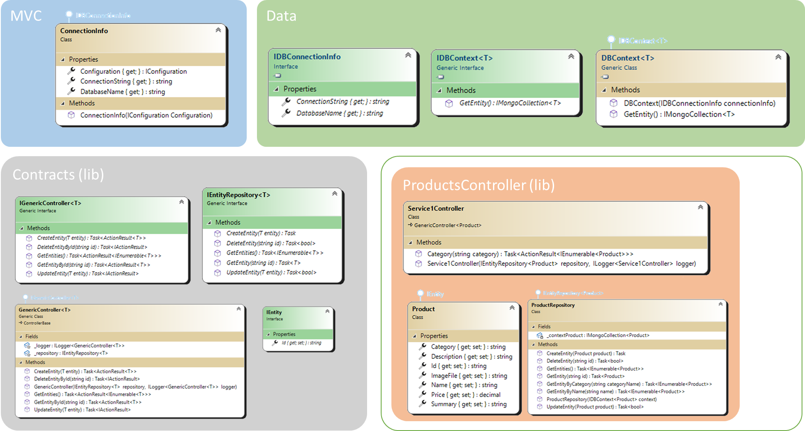

## The Controller Injection Solution

## Overview



In this solution, the components are separated into differents projects. The basic **MVC** project and the **contract** project remain, enriched with further *interfaces* for the implementation of the various modules. The **DataLayer** project is introduced, which provides, in addition to the connection to the DB, also for the generalization of the *repository* for the specific **controller**. As for the project with dynamic entities, libraries are implemented here for the **controllers** that will be imported into the core of the **MVC** project.
The goal of this solution is to solve the limitations of the project with the loading of the entities, increasing the customization of the controller.

## Classes

### Data Library

#### IDBConnectionInfo (interface)

This *interface* simply defines the information needed by the database classes needed for the connection. They will be defined by the **MVC** platform and passed at the necessary time, in this way the information will still remain centralized within the core of the system and each component will still be able to pass its own information, allowing customization even at this level.

#### IDBContext&lt;T&gt; (interface) and DBContext&lt;T&gt; (class)

The **IDBContext** *interface* and its **DBContext** *class* do not change significantly from those already implemented in the solution with dynamic entities. Refer to those for further information.

### Contracts

#### IEntity (interface)

Also in this case the **IEntity** *interface* remains unchanged with respect to the one proposed for the solution of dynamic entities. It's however very simple to understand.

#### IEntityRepository&lt;T&gt; (interface)

The **IEntityRepository** *interface* also remains the same, but in this project moved to the **contracts** library, as it will be for reference for the developer who will have to create their own *repository* for the implemented controller.

#### IGenericController&lt;T&gt; (interface)

The **IGenericController** is the real new introduction to this project. Like the *interface* to the *repository*, this defines the **controller** behaviors that the **MVC** project knows and expects to be implemented. This is the first chance the developer has to implement their own **controller**.

#### GenericController&lt;T&gt; (class)

The **GenericController** *class* implemented in the dynamic entity solution has been reused in this project as is, but extending it from the *interface*. The class has been included among the contracts as it represents a possible alternative for developers to extend it by implementing only the specific methods of the **controller**, inheriting a set of standard behaviors for the part of the **CRUD** on the introduced entity.

### Controller Library

#### Product (class)

Still nothing new, the products implemented in the solution of the entities are re-proposed as they are.

#### ProductRepository (class)

The specific *repository* for the **product** *entity* is implemented in the same way as its counterpart in the dynamic entity solution. We could have opted for a solution similar to that of the *controller* (a *class* ready to use for the developer), where a generic **EntityRepository** already implemented was available to the developer, but for this type of information it is preferable to leave it to the developer to implement the whole *class* and allow the most appropriate implementation possibilities. Despite everything, the adoption of a generic **class** can still be considered a very valid solution.

#### Service1Controller

The implementation of the **controller** is very simple; exploiting in this case the second possibility for the developer, it extends the base class in the *contracts* to inherit the behaviors of the **CRUD** functionalities on the *entity* of the **products**, thus not having to write code on that front, but enriches the *class* with a custom method that search by **products**' *category*.

### MVC Portal

#### ConnectionInfo (class)

Nothing to say about this *class*, which simply uses the portal configuration to return the DB connection information requested by the **DBContext**.

## Process concept explained

Also in this case the core of the library loading system is located in the **MVC** portal startup, but simplified by the generation of the *class* at runtime which increases the complexity of the project with dynamic loading of the entities.

```C#
            foreach (string file in Directory.EnumerateFiles(".\\bin\\Controllers\\", "*.dll"))
            {
                var assembly = System.Reflection.Assembly.LoadFrom(file);

                var entityType = assembly.GetExportedTypes().Single(t => t.IsAssignableTo(typeof(IEntity)));
                services.AddScoped(typeof(IEntity), entityType);

                services.AddScoped(
                    typeof(IDBContext<>).MakeGenericType(entityType),
                    typeof(DBContext<>).MakeGenericType(entityType));

                var inttype = typeof(IEntityRepository<>).MakeGenericType(entityType);
                var repositoryType = assembly.GetExportedTypes().Single(t => t.IsAssignableTo(inttype));
                services.AddScoped(inttype, repositoryType);

                services.AddMvc().AddApplicationPart(assembly).AddControllersAsServices();
            }
```

The process is the same, the libraries contained in the "**controller**" folder are loaded as *assemblies*. The engine expects three specific implementations in each library, a *class* that implements the **IEntity** *interface*, another one for the **IEntityRepository** *interface* specifying the generics with the *entity* type just loaded and finally the **controller** *class* that is automatically added to the portal by adding the **controllers** present in the assembly itself.
The *entity* is immediately loaded with reference to the *interface* (for the **IoC** *engine*). The same is true for the *repository*, but first the entity-specific *data context* and *repository* *interface* are instantiated, which will later be used for dynamic resolution and *class* injection.

## New Controller implementation

The implementation in this context is really simple, just create a new library by implementing the **IEntity** and **IEntityRepository** *interfaces* of the specific *entity type*. For the **controller** the choices, as seen, are two:

* implement the **IGenericController** *interface* of the specific *entity type*, customizing everything to a very detailed level.
* extend the **GenericController** *class* always of the specific *entity type*, keeping the standard basic **CRUD** and going to implement only the additional methods desired to enrich the **controller** with extra features.

> Of course it is also possible to extend the class and override only one of the methods of the CRUD that you want to change.

## Considerations

This solution slightly increases the amount of code to be written compared to the solution with the loading of dynamic entities (three classes to be implemented compared to the single one of the other solution). In spite of everything, as customization it is possible to reach much higher levels, having the possibility (excluding the constraints of the contracts) to build a much more flexible controller.
