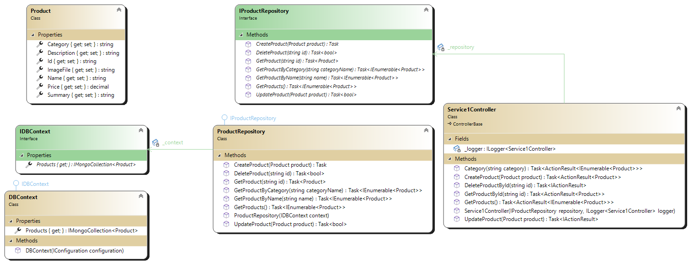

## The Original Solution

## Overview

The original solution is represented by a single project, in which all components integrate with each other in a simple way.

The project is a simple **Web Application** based on **MVC pattern**, but without the view sn the model (replaced by the database entity on which the classic **CRUD** operations are performed).

In this case the example reports the implementation of the **CRUD** on the **product** entity.

In addition to the **MVC pattern**, the **pattern repository** is used for data layer abstraction and the **dependency injection**.

The activation and registration of the classes necessary for the dependency injection is carried out in the startup class of the project.

```C#
[...]
            services.AddScoped<IDBContext, DBContext>();
            services.AddScoped<IProductRepository, ProductRepository>();
[...]
```

## Classes



### Product (class)

Identifies the database entity on which to perform CRUD operations.

### IDBContext (interface)

The **IDBContext** *interface*, in addition to defining the basic characteristics of the database instance with all the collections inside it, is used by the **Inversion of Control** (IoC) *engine* to inject the instance to the various repositories that will be created in the project.

### DBContext (class)

The **DBContext** class is the implementation of its *interface* that contains the **product** entity collection referenced in the database.

### IProductRepository (interface)

The **IProductRepository** *interface* defines the specific repository of the entity **product**. Contains the signatures of the **CRUD** operations that will be used within the controller. It is the interface used on the controller to inject the concrete repository instance.

### ProductRepository (class)

The **ProductRepository** *class*, a specific implementation of its *interface*, represents the concrete instance of the repository. The constructor requires a DB instance (**IDBContext**) which is injected by the **IoC** *engine* at runtime (**DBContext**). All the methods of the **CRUD** implemented in this class access through the *interface* to the **products**' collection to carry out each operation.

### Service1Controler (class)

The controller also uses the *interface* definition to allow that the **IoC** *engine* inject the repository instance defined at runtime. The methods are also decorated so that the swagger generated by the platform is complete with the information a developer needs to use and invoke the exposed APIs.

## New Controller implementation

To implement a new functionality within the project and therefore insert a new **CRUD** on another entity, the implementation of all the interfaces and classes just listed is necessary.

We start from the implementation of the *class* that identifies the new database entity (for example **Order**). The controller we will create will need its *repository*, but it will have to be injected by the **IoC** *engine*, so we need a new *interface* that identifies the generic instance that will be passed (**IOrderRepository**).

It is therefore now possible to implement the specific *repository* (**OrderRepository**) in which the database instance will be referenced through the interface (**IDBContext**) to make the dependency injection work in the correct way to which we will have previously added an instance of the collection of the database entity (**IMongoCollection&lt;order&gt;**) used by the *repository*.

All that remains is to implement a new *controller* by extending the **ControllerBase** class in whose constructor to pass the *repository interface*.

Obviously all the *classes* and *interfaces* will have to be registered in the startup of the project for the **IoC** engine.

## Considerations

Although the architectural design of the application is impeccable from a *best-practice* point of view (with the exception perhaps of the subdivision of projects, but remember that this example is purely for educational purposes), the implementation of a number of *classes* and *interfaces* of this level inevitably leads to an exponential growth of the **redundant code**. In fact, all the *classes* would be nothing more than the reproduction of the already existing code, where it would actually be enough to instruct the *class* to perform the same operations on a different *entity*. However, there would remain the problem of the **injection** of distinct *classes* into the various instances.
There is also the point that with each implementation, the MVC portal must, in any case, be republished for each new CRUD introduced.

These two aspects are addressed in the projects versioned in the two branches of this repository.
