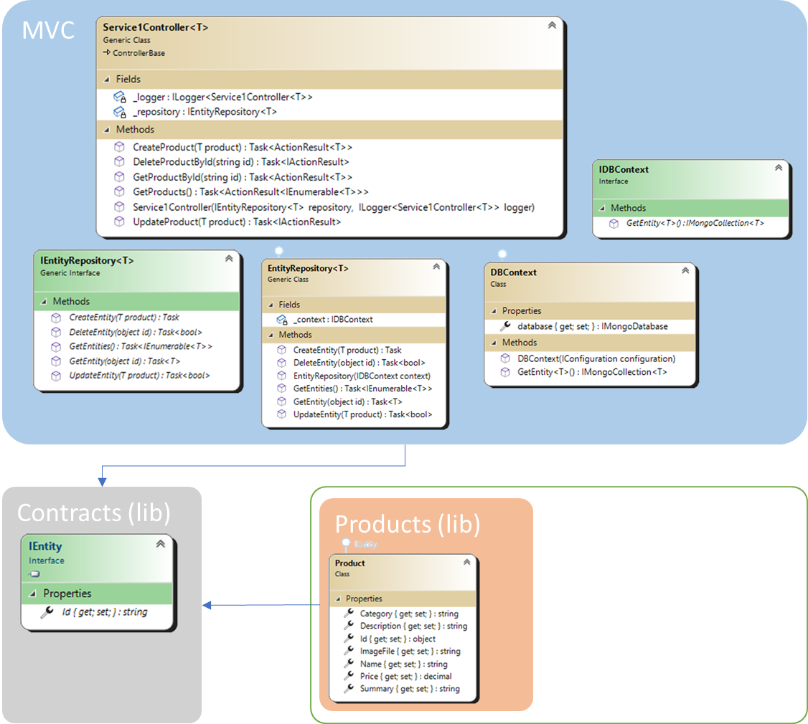

## The Entity Injection Solution

## Overview

In the proposed solution, the objective is to solve, first of all, the problem of releasing the **MVC** portal at each new implementation, adopting a "**plug-in**" loading system, in which it will only be necessary to copy the new library (which will introduce the new feature) in a specific folder. Furthermore, the writing of the code will be reduced to the simple implementation of the structure (**class**) that represents the database's table to managed through the **CRUD** operations. The rest will be completely generalized and used at runtime.



In the *diagram* above, the new architecture is represented, where a library of "**contracts**" has been implemented which defines, for the MVC project, the rules, the basic behavior and the characteristics of the new *entity* (in this case only the entity *interface* which must be implemented by the developer), the **MVC** portal itself and a *series of libraries* containing the *entities* to be managed (only that of the **products** for the moment).

The diagram shows how both the **MVC** project and the implemented entities must include the contract library.

## Classes

### IEntity (interface)

In the **contract library**, the only interface available at the moment is that of the *Entities*, which each implementation must comply with. Inside it is visible (at the moment) only the **Id** field, which represents the equivalent **key** field of the *database table* (defined as *object* in order to have a great deal of flexibility).

Further common implementations to all the tables or behaviors will be possible to add them by defining them within the *interface* and allowing the portal to manage them; obviously, in this case, a rebuild of the projects and a new release will be inevitable.

### Product (class)

The first *entity* that will be managed through modeling a standard **CRUD** is the **product**. It is easy to imagine that the *entity*, in this case, will contemplate a simple list of fields, on which it will be possible to specify characteristics strictly related to the real ones of the database table to which it refers.

### IDBContext (interface)

While in the *interface* of the original project, each entity had its relative collection within the data context, in this case it is not possible to know in advance the entities that will be part of the database manager (will be lost the concept of dynamic loading that we are trying to introduce), the interface that must be known by the various components of the project will use a "**generic**" method that will return a **typed** collection of the specific *entity*, even if it does not know it.

### DBContext (class)

The implementation of the *class* is really simple and will take advantage of the typed functions available in the database library used for the purpose (in this case a **Mongo database**).

### IEntityRepository&lt;T&gt; (interface)

The implementation of the **pattern repository** becomes slightly more complex, not so much in the development, but in the concept that follows on the basis of a "**generic**" repository of entities not defined within the project. The interface *generalizes* itself, constraining the **generic type** to be an implementation of the **IEntity** *interface* (specific in the contracts library). The operations applicable to the repository are those already defined as **CRUD** operations. Despite everything, the *interface*, as in the original project, will have the task of identifying the right classes for the use of **Dependency Injection** by the **IoC engine**.

### EntityRepository&lt;T&gt; (class)

Also the *class* that identifies the repository is, in turn, **typed** through the **generics**, as it is not aware of the entities. Also in this case the constraint on the characteristics of the generic are expressed as in its interface (have to extend the **IEntity** *interface*). The implementation is simple and reports the same operations as the original project, retrieving the correct collection through the method introduced in the context database implemented above.

### Service1Controller&lt;T&gt;

As much as the *controller* might seem the core of the whole process, its implementation respects the canons already addressed for the other components of this project (the *repository*, the database *context* and the *entity*). It is therefore easy to understand, also implementing this through a **generic**. The *class*, obviously, inside the **MVC** is not identified as a *controller* and therefore not exposed (or in any case not in the specific implementation of the *entity*). The *class*, however, uses the **IEntityRepository** *interface* which will be implemented in the specific type used to extend the *class*. The actions of the controller respect the **CRUD** methods of the standard management, invoking the relative methods of the specific *repository*.

## Process concept explained

The real core of the whole process is instead found in the startup code of the application.

```C#
            foreach (string file in Directory.EnumerateFiles(".\\bin\\Entities\\", "*.dll"))
            {
                var assembly = Assembly.LoadFrom(file);
                foreach (Type type in assembly.GetExportedTypes())
                {
                    if (type.IsAssignableTo(typeof(IEntity)))
                    {
                        services.AddScoped(typeof(IEntity), type);

                        var inttype = typeof(IEntityRepository<>).MakeGenericType(type);
                        var enttype = typeof(EntityRepository<>).MakeGenericType(type);
                        services.AddScoped(inttype, enttype);
                        var servicecontroltype = typeof(Service1Controller<>).MakeGenericType(type);
                        var registerclass = TestClassCreation(servicecontroltype, inttype, services);
                        services.AddScoped(servicecontroltype, registerclass);
                    }
                }
            }
```

First of all, all the libraries present in the "**Entities**" folder are loaded as *assemblies*. All the *classes* contained within are then cycled, working exclusively on those that extend the **IEntity** interface.
The first action is to register the type as one of the possible extensions of the **IEntity** *interface* (it is not strictly necessary).

Specifically, the controller will need the *interface* and repository *class* that implement the *entity* to be able to register them within the **IoC engine**, but which are currently not present in the project. They must therefore be generated at runtime. This is what the next three lines of code do; implementation of the **IEntityRepository<product&gt;**, **EntityRepository<product&gt;** and then add them to the **IoC**.

The next step is perhaps the most complex one. It's necessary to implement the *controller class*, but it will not be enough to extend it as for the *repository*, the *class* must be **developed and compiled at runtime**. The *base class* is then defined using the same mechanism as the *repository*. The definition, alone, however, is not enough, so the *class* is also implemented by the "**ClassCreation**" function.

```C#
        private Type ClassCreation(Type t, Type arg1, IServiceCollection services, string name)
        {
            var moduleName = $"Service{name}";
            var newTypeName = $"Service1.API.Controllers.{moduleName}";
            var assemblyName = new AssemblyName(newTypeName);
            var dynamicAssembly = AssemblyBuilder.DefineDynamicAssembly(assemblyName, AssemblyBuilderAccess.Run);
            var dynamicModule = dynamicAssembly.DefineDynamicModule(moduleName);
            var dynamicType = dynamicModule.DefineType(newTypeName, TypeAttributes.Public | TypeAttributes.Class, t);

            var constructor = dynamicType.DefineConstructor(MethodAttributes.Public, CallingConventions.Standard, new Type[] { arg1, typeof(ILogger<>).MakeGenericType(t) });
            var ilGenerator = constructor.GetILGenerator();
            ilGenerator.Emit(OpCodes.Ldarg_0);
            ilGenerator.Emit(OpCodes.Ldarg_1);
            ilGenerator.Emit(OpCodes.Ldarg_2);
            ilGenerator.Emit(OpCodes.Call, t.GetConstructors()[0]);
            ilGenerator.Emit(OpCodes.Nop);
            ilGenerator.Emit(OpCodes.Nop);
            ilGenerator.Emit(OpCodes.Ret);

            var created = dynamicType.CreateType();
            services.AddMvc().AddApplicationPart(dynamicAssembly).AddControllersAsServices();
            return created;
        }
```

The function accepts as input parameters the *base class* of the *controller* to be extended, the first parameter of the constructor of the *base class* (**IEntityRepository&lt;Product&gt;** resolved by the IoC which will pass its instance of **EntityRepository&lt;Product&gt;**), the *service controller* for registering the new *class* as an **MVC** portal controller and the entity name used to define the name of the implemented class.

The module, class and assembly names are then generated. A new **assembly** is dynamically created and finally the new type (or *class*) is created with *public* access and which extends the *class* defined externally to the function. The **constructor** is defined (which respects the original one of the *base class*). However, the **constructor** must be implemented, obviously it will be enough to call the *constructor of the base class*, but it must still be implemented. To do this, **MSIL** (**Microsoft Intermediate Language**) is used. The constructor code is therefore equivalent to pushing the method name (**Ldarg_0**) plus the two parameters defined in the constructor (**Ldarg_1** and **Ldarg_2**). The **constructor** of the *base class* is then called and finally the method is closed with a couple of **nops** (*no operations*) and the return to the main process. The new *class* is then definitively created and returned. But first, for the new **controller** to be visible as such to the **MVC** portal, the new assembly must be registered within the *Controller Service* which will retrieve all the controllers inside it.

## New Controller implementation

In this scenario, implementing a new **controller** simply boils down to implementing a new *entity*, through the **IEntity** *interface*. The *library* project will generate a **dll** that just need to copy inside the "**Entities**" folder.

> The loading of the new library can be done through a "hot reloading" system not yet implemented at the moment. Alternatively, restarting the web server will rework the start function and load all libraries, including the new one.

## Considerations

The process of *generating the class at runtime* is perhaps the only critical point of the whole project. Adopting a processing method of this type may seem somewhat complex, but it brings acceptable benefits. The writing of the code is reduced to minimum levels: a simple *class* that identifies the database table to be managed, all the rest of the work is done by the core of the **MVC** portal. Obviously, the behavior of the portal is also standardized to extreme levels, binding the **controller** to well-defined and equal operations for all entities. Therefore, the level of customization of the **CRUD** is greatly lowered.
